# SDR++ Source-to-Sink Pipeline, Threading, Buffers, and Latency

This is an independent read of the receive pipeline from a source module to a
sink module. It focuses on the normal desktop UI path:

Source module -> `IQFrontEnd` -> one VFO -> radio decoder -> `SinkManager::Stream`
-> `audio_sink`.

Other source and sink providers have their own worker/callback details, but the
core DSP graph is built out of the same primitives.

## Executive Summary

SDR++ uses a mostly "one DSP block, one worker thread" architecture. Edges
between blocks are `dsp::stream<T>` objects: a blocking, double-buffered,
single-producer/single-consumer hand-off with one packet of queue depth.

There are important exceptions:

- `SampleFrameBuffer<T>` starts two threads and optionally uses a 32-slot packet
  ring.
- `Reshaper<T>` starts two threads and uses an internal `RingBuffer<T>`.
- Source and sink modules often add driver callback threads or module-specific
  worker threads.
- WFM starts an RDS/diagnostic side pipeline even when RDS is disabled; those
  threads mostly block, but they still exist.

The most important latency knobs are source packet size, the input frame buffer,
audio sink packet size, audio driver buffering, and FIR/resampler group delay.
Per-edge double buffering limits backpressure, but under light load it does not
mean that every DSP edge necessarily adds one full packet of latency.

## Core Primitives

### `dsp::stream<T>`

Defined in `core/src/dsp/stream.h`.

Each stream allocates two buffers:

- `writeBuf`
- `readBuf`

Default capacity is `STREAM_BUFFER_SIZE = 1,000,000` elements. This is a maximum
packet capacity, not normal queue depth.

Synchronization uses two mutex/condition-variable pairs:

- Writer side: `swapMtx`, `swapCV`, `canSwap`, `writerStop`
- Reader side: `rdyMtx`, `rdyCV`, `dataReady`, `readerStop`

The protocol is:

1. The writer fills `writeBuf`.
2. `swap(size)` waits for `canSwap`, swaps `writeBuf` and `readBuf`, stores
   `dataSize`, clears `canSwap`, sets `dataReady`, and wakes the reader.
3. `read()` waits for `dataReady` and returns `dataSize`.
4. The reader consumes `readBuf`.
5. `flush()` clears `dataReady`, sets `canSwap`, and wakes the writer.

So each stream normally holds at most one unread packet. If a consumer is slow,
the upstream producer blocks in `swap()`.

### `dsp::block`

Defined in `core/src/dsp/block.h`.

Most DSP nodes derive from `block` through `Processor<I, O>` or `Sink<T>`.
`block::start()` spawns a worker thread, and the worker calls `run()` until it
returns a negative value.

`block::stop()` stops by poisoning all registered input readers and output
writers:

- `stopReader()` wakes a blocked `read()`.
- `stopWriter()` wakes a blocked `swap()`.
- The worker joins.
- Stop flags are cleared afterward.

`tempStop()` and `tempStart()` are nestable reconfiguration pauses. They stop and
restart the worker only at the outermost nesting level.

## Basic Pipeline Diagram

```mermaid
flowchart LR
    subgraph SRC["Source module"]
        SRCW["driver callback or source worker"]
    end

    subgraph FE["IQFrontEnd"]
        INBUF["SampleFrameBuffer<br/>2 threads<br/>bypass or 32-slot ring"]
        PRE["preproc chain<br/>decim / dcBlock / conjugate<br/>0-3 threads"]
        SPLIT["IQ splitter<br/>1 thread"]
        FFTRESH["FFT Reshaper<br/>2 threads"]
        FFTSINK["FFT handler<br/>1 thread"]
        VFO["RxVFO<br/>xlator + resampler + FIR<br/>1 thread"]
    end

    subgraph RADIO["Radio module"]
        IFCHAIN["IF chain<br/>NB / squelch / FM IF NR<br/>0-3 threads"]
        DEMOD["selected demodulator<br/>usually 1 main audio thread"]
        WFMEXTRA["WFM RDS/diagnostic side branch<br/>5 extra threads when WFM selected"]
        AFCHAIN["AF chain<br/>resampler + optional deemphasis<br/>0-2 threads"]
    end

    subgraph SINK["SinkManager + audio_sink"]
        SSPLIT["Stream splitter<br/>1 thread"]
        VOL["Volume<br/>1 thread"]
        PACK["audio_sink stereo packer<br/>1 thread"]
        OUTCB["RtAudio output callback<br/>driver thread"]
    end

    SRCW -. "dsp::stream<complex_t>" .-> INBUF
    INBUF -. "stream" .-> PRE
    PRE -. "stream or bypass pointer" .-> SPLIT
    SPLIT -. "fftIn" .-> FFTRESH
    FFTRESH -. "fixed FFT packet" .-> FFTSINK
    SPLIT -. "vfo input" .-> VFO
    VFO -. "IF stream" .-> IFCHAIN
    IFCHAIN -. "IF stream" .-> DEMOD
    DEMOD -. "stereo_t audio" .-> AFCHAIN
    DEMOD -. "WFM only, mostly blocked if RDS disabled" .-> WFMEXTRA
    AFCHAIN -. "audio stream" .-> SSPLIT
    SSPLIT -. "volumeInput" .-> VOL
    VOL -. "sinkOut" .-> PACK
    PACK -. "fixed audio packets" .-> OUTCB
```



Dashed arrows are `dsp::stream<T>` hand-offs unless the chain has all blocks
disabled, in which case the chain output is just the upstream stream pointer.

## Threading

### Baseline Thread Inventory

These counts are for one source, one VFO, one radio module, and the desktop
`audio_sink`.

| Component | Threads | Notes |
| --- | ---: | --- |
| Selected source module | usually 1 | Source-specific: a callback thread, worker thread, or client thread. Some network sources add more. |
| `SampleFrameBuffer` | 2 | Always starts both its input worker and ring-output worker. In bypass mode the second thread waits idle. |
| Preproc chain | 0-3 | `decim`, `dcBlock`, and `conjugate` only run when enabled. |
| IQ splitter | 1 | Serially copies a packet to every bound output stream. |
| FFT `Reshaper` | 2 | One thread reads `fftIn` into a ring; another emits reshaped FFT packets. |
| FFT handler sink | 1 | Runs windowing, FFTW, and power conversion. |
| `RxVFO` | 1 per VFO | Frequency translation, resampling, and optional FIR are fused into one thread. |
| IF chain | 0-3 per radio | Noise blanker, squelch, FM IF noise reduction when enabled. |
| Main demodulator | usually 1 | WFM/NFM/AM/SSB/RAW each have one main output block. |
| WFM RDS/diagnostic side branch | 5 | WFM starts `RDSDemod`, RDS byte handler, float `Reshaper` with two threads, and diagnostic handler. These mostly block when RDS/advanced info is disabled. |
| AF chain | 0-2 | Resampler when post-processing is enabled; deemphasis when selected. WFM default enables deemphasis. |
| `SinkManager::Stream` splitter | 1 | Fans audio to the selected sink and any extra consumers. |
| Volume block | 1 | Marked by code comment as removable. |
| `audio_sink` stereo packer | 1 | Mono conversion and mono packer exist but are not started by the desktop audio sink. |
| RtAudio output callback | 1 driver-owned | Calls `stereoPacker.out.read()`. |

Concrete examples:

- Basic NFM-style pipeline with waterfall, no optional IF blocks, no deemphasis:
  about 14 threads including source and RtAudio callback.
- Default WFM radio path with waterfall and desktop audio sink:
  about 20 threads, because WFM default enables deemphasis and also starts the
  five-thread RDS/diagnostic side branch.
- Each additional VFO/radio module adds at least VFO + demod + AF + sink stream
  threads, and possibly WFM side threads or optional IF blocks.

These counts do not include the UI/render thread, config autosave threads,
module manager work, file-dialog workers, or source-specific helper threads.

### Start, Stop, Pause, Resume

The UI initializes and starts `IQFrontEnd` in `MainWindow::init()` before a
source is playing. It starts:

- `inBuf`
- enabled preproc blocks
- IQ splitter
- existing VFOs
- FFT reshaper
- FFT handler

Pressing play starts only the selected source through `SourceManager::start()`.
When playback stops, the source stops and the input buffer is flushed, but the
front-end and decoder worker threads remain alive and blocked on their streams.

Creating a radio module creates a VFO, wires the IF chain, selected demodulator,
AF chain, and sink stream, then starts those chains. `IQFrontEnd::addVFO()`
starts the `RxVFO` immediately.

Block-level stop uses stream stop flags to wake any blocked `read()` or
`swap()`, then joins the worker thread. Reconfiguration generally uses
`tempStop()` / `tempStart()`: sample-rate changes, VFO bandwidth changes,
demodulator switches, resampler rates, and enabling/disabling chain blocks.

Two notable details:

- `IQFrontEnd::setBuffering()` only flips `inBuf.bypass`; it does not pause the
  frame-buffer workers around that flag change.
- The audio sink starts the RtAudio stream before starting `stereoPacker`, so
  the callback may briefly wait for the packer to produce its first packet.

## Buffer Sizes and Queue Depths

### Streams

Every `dsp::stream<T>` defaults to:

- 2 buffers
- 1,000,000 elements per buffer
- one unread packet of queue depth

Memory examples:

- `complex_t`: 8 bytes, so one stream allocates about 16 MB.
- `stereo_t`: 8 bytes, so one stream allocates about 16 MB.
- `float`: 4 bytes, so one stream allocates about 8 MB.

The packet size is usually much smaller than 1,000,000 samples. The large
allocation is a capacity ceiling.

### `SampleFrameBuffer<T>`

`core/src/dsp/buffer/frame_buffer.h`.

In addition to its output stream, it allocates:

- `TEST_BUFFER_SIZE = 32` frame buffers
- each frame buffer has `STREAM_BUFFER_SIZE` elements

For `complex_t`, that ring allocation is roughly 256 MB.

However, the ring does not have a full/empty distinction and the writer never
waits for ring capacity. It uses only `writeCur` and `readCur`; if the producer
laps the consumer, unread frames can be overwritten and the modulo arithmetic can
make the buffer look empty. In practice it is a burst absorber with possible
drop/overwrite behavior, not a reliable blocking 32-packet queue.

When `bypass = true`, the input worker copies directly from input stream to
`out` and swaps downstream. The ring-output worker still exists, but it waits on
the ring condition variable.

Important default: `MainWindow::init()` initializes `IQFrontEnd` with buffering
enabled. The file source disables buffering while selected and re-enables it
when deselected.

### `Reshaper<T>`

`core/src/dsp/buffer/reshaper.h`.

`Reshaper` starts two threads:

- one thread reads the input stream and writes into a `RingBuffer<T>`
- one thread reads/skip-gathers from that ring and swaps fixed-size output
  packets

The internal `RingBuffer<T>` allocates 1,000,000 elements, but `Reshaper` sets
`maxLatency = keep * 2`. For the front-end FFT path, default settings are
8 Msps, FFT size 1024, FFT rate 20 Hz:

- `keep = min(sampleRate / fftRate, fftSize) = 1024`
- `skip = 400000 - 1024`
- reshaper output is 1024 samples, 20 times per second
- ring backpressure is limited to about 2048 readable samples

This FFT branch can still backpressure the IQ splitter if the reshape/FFT path
cannot keep up.

### Audio `Packer<T>`

`core/src/dsp/buffer/packer.h`.

The packer accumulates samples until it has `samples`, then swaps that fixed-size
packet downstream. For desktop `audio_sink`, `samples` is set to RtAudio's
`bufferFrames`, initialized as:

```cpp
bufferFrames = sampleRate / 60;
```

At 48 kHz this is 800 frames, or 16.67 ms.

The desktop audio sink only starts `stereoPacker`. `s2m` and `monoPacker` are
constructed but not started in this sink implementation.

### Source and Sink Driver Buffers

Many source modules aim for around 5 ms packets:

- `audio_source`: `sampleRate / 200`
- `file_source`: `sampleRate / 200`
- many hardware/network sources use similar `sampleRate / 200` block sizes

The desktop audio sink uses about 16.67 ms packets:

- `audio_sink`: `sampleRate / 60`

Actual driver latency may be larger than one callback period depending on the
backend and device.

## End-to-End Latency

There is no single fixed latency. A useful model for the main audio path is:

```text
latency ~= source acquisition packet time
         + SampleFrameBuffer queue time
         + DSP compute and thread wake-up time
         + FIR/resampler/demodulator group delay
         + audio packer fill time
         + audio backend/device output buffering
```

For a sample at a random position within a packet, the average source packet
wait is roughly half a source packet. The worst sample in that packet waits
almost a full source packet before the source callback/worker can publish it.

With an audio source at 48 kHz:

- source packet: 48,000 / 200 = 240 samples = 5 ms
- audio sink packet: 48,000 / 60 = 800 frames = 16.67 ms

With `SampleFrameBuffer` bypassed and a healthy CPU, a practical lower-bound
shape is:

- a few ms of source packetization
- a few ms of DSP/filter/resampler delay
- 0 to 16.67 ms packer fill
- at least about one 16.67 ms audio device period

That puts an optimistic desktop-audio path in the tens of milliseconds, often
around 30-50 ms once driver and filter delays are included.

With `SampleFrameBuffer` buffering enabled, queue time can vary by whole source
packets. At 5 ms source packets, 31 queued packets would be about 155 ms. If the
producer laps the consumer, the current implementation can overwrite/drop frames
instead of applying clean backpressure.

Per-edge `dsp::stream` buffers do not normally add one full packet of latency
per stage when the pipeline is keeping up. They do bound each edge to one unread
packet and create backpressure when the next block cannot flush. In overload,
there can be one packet sitting on many edges, but that is a stalled or
near-stalled state rather than the nominal steady-state latency.

The audio output callback is also important: `audio_sink` calls
`stereoPacker.out.read()` directly in the RtAudio callback. If no packet is
ready, the callback blocks; it does not currently synthesize silence on underrun.

## Ways to Lower Latency

1. Disable or replace `SampleFrameBuffer` for low-latency live operation.
   If buffering is needed, use a bounded SPSC ring with explicit full/empty
   state, an intentional drop policy, and queue-depth telemetry.

2. Reduce source packet sizes where backends allow it. Many sources use
   `sampleRate / 200` (5 ms). Smaller packets reduce packetization delay but
   increase callback/wakeup overhead.

3. Reduce desktop audio sink packet size. `sampleRate / 60` is 16.67 ms at
   48 kHz. Moving toward `/120` or `/240` can lower latency if the backend and
   CPU can tolerate the wakeup rate.

4. Make the audio callback non-blocking. A small audio ring with silence on
   underrun would avoid blocking the driver callback and make underruns visible.

5. Start the audio packer before starting the RtAudio stream, or prefill one
   packet before opening playback.

6. Avoid starting WFM RDS/diagnostic side branches unless RDS or diagnostic
   display is enabled. This mainly reduces thread count and scheduling noise.

7. Fuse cheap always-adjacent blocks. Candidates include `Volume` into the sink
   stream or previous audio stage, and selected AF post-processing into
   demodulators where appropriate.

8. For a larger refactor, replace one-thread-per-block with a small scheduler or
   a compact single-worker mode for one-VFO, one-sink audio. This would remove
   many condition-variable wakeups, but it is a bigger architectural change.

## Pipeline Variability

Topology is highly dynamic:

- Source selection rewires `IQFrontEnd` input.
- Sources have different threading models and packet sizes.
- VFO creation adds a splitter output, one `RxVFO`, and usually a full decoder
  and sink path.
- Preproc, IF, and AF chains can enable/disable blocks at runtime.
- Demodulator selection destroys and recreates the demodulator subgraph.
- Sink providers can be swapped, changing the final buffering and thread model.
- Extra consumers can bind to IQ or audio splitters.

Timing is also variable:

- Source modules pace the graph by publishing packets.
- `Splitter<T>` writes outputs serially. A blocked output stream can block the
  splitter and therefore all later outputs and the upstream pipeline.
- `SampleFrameBuffer` can absorb or drop bursts depending on producer/consumer
  timing.
- `Reshaper` introduces a second queue and a different cadence on FFT/diagnostic
  branches.
- OS scheduling and condition-variable wakeups matter because many stages are
  separate threads.
- Audio callback blocking can turn audio underruns into callback stalls.

## Differences From `doc/Pipeline.md`

`doc/Pipeline.md` is broadly right about the central `dsp::stream<T>` protocol
and the general one-thread-per-block model. My main differences are:

1. `SampleFrameBuffer` always starts two threads. In bypass mode the ring reader
   is idle, but it is still a started thread.

2. The UI initializes `IQFrontEnd` with buffering enabled. The existing document
   says buffering is off by default; that is true for the file source while it is
   selected, but not for the front-end's initial/default UI setup.

3. The input frame buffer is not a clean 32-packet blocking queue. It has 32
   slots, but no full detection and no writer wait on ring capacity, so overflow
   can overwrite/drop queued frames.

4. `Reshaper<T>` is a two-thread block, not one thread. This affects the FFT
   path and WFM diagnostic reshaper.

5. The desktop `audio_sink` starts only the stereo packer. The mono converter and
   mono packer are present but not part of the running desktop audio path.

6. The RtAudio output callback blocks on `stereoPacker.out.read()`; it does not
   fill silence on underrun in the code I read.

7. Default WFM starts a five-thread RDS/diagnostic side branch even when RDS is
   disabled. Those threads mostly block, but they should be counted when asking
   "how many threads exist?"

8. I would not model nominal latency as one packet per stream edge. The stream
   queue depth bounds backpressure and overload behavior. Nominal latency is
   better modeled as packetization + explicit queues + DSP/filter delay + audio
   pack/device buffering.

## Source References

- `core/src/dsp/stream.h`
- `core/src/dsp/block.h`
- `core/src/dsp/processor.h`
- `core/src/dsp/sink.h`
- `core/src/dsp/chain.h`
- `core/src/dsp/routing/splitter.h`
- `core/src/dsp/buffer/frame_buffer.h`
- `core/src/dsp/buffer/ring_buffer.h`
- `core/src/dsp/buffer/reshaper.h`
- `core/src/dsp/buffer/packer.h`
- `core/src/dsp/channel/rx_vfo.h`
- `core/src/signal_path/iq_frontend.h`
- `core/src/signal_path/iq_frontend.cpp`
- `core/src/signal_path/source.h`
- `core/src/signal_path/source.cpp`
- `core/src/signal_path/sink.h`
- `core/src/signal_path/sink.cpp`
- `core/src/signal_path/vfo_manager.cpp`
- `core/src/gui/main_window.cpp`
- `decoder_modules/radio/src/radio_module.h`
- `decoder_modules/radio/src/demod.h`
- `decoder_modules/radio/src/demodulators/wfm.h`
- `decoder_modules/radio/src/rds_demod.h`
- `sink_modules/audio_sink/src/main.cpp`
- `source_modules/audio_source/src/main.cpp`
- `source_modules/file_source/src/main.cpp`
