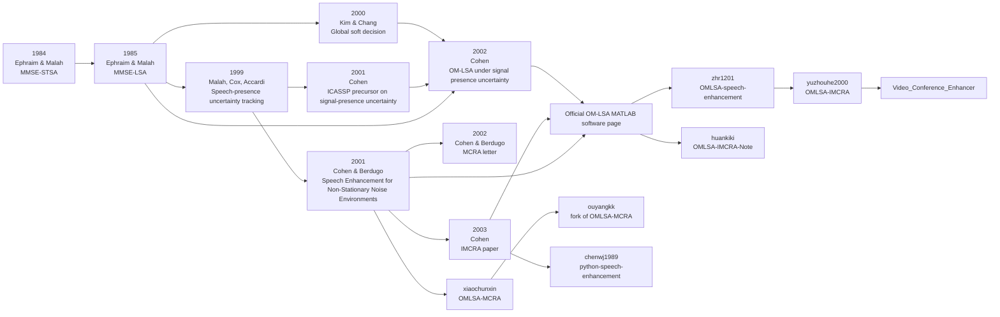

# Deep Research Report on OMLSA-MCRA and OMLSA-IMCRA

## Executive Summary

The two repositories implement closely related members of the same classical speech-enhancement family: **OM-LSA** spectral gain estimation combined with a **noise power spectral density estimator**. The decisive difference is the noise estimator: the C++ repository by **xiaochunxin** is framed as **OMLSA-MCRA**, while the Python repository by **yuzhouhe2000** is framed as **OMLSA-IMCRA**. In the original literature, **MCRA** is the earlier “minima controlled recursive averaging” noise estimator, and **IMCRA** is Cohen’s later “improved minima controlled recursive averaging” method, designed to better handle highly nonstationary noise and low-SNR conditions. The official software page maintained by Israel Cohen explicitly describes downloadable MATLAB software for **OM-LSA + IMCRA**, citing the 2001 OM-LSA/MCRA paper and the 2003 IMCRA paper as its algorithmic basis. citeturn42view0turn42view1turn31view0turn24search9turn13search12

From a repository-engineering perspective, the projects serve different purposes. **OMLSA-MCRA** is a performance-oriented C++ implementation that emphasizes radix-4 FFT, gain-table approximation, CORDIC, fixed-point arithmetic, and the “two real sequences in one FFT” optimization; the repository is sparse on paper citations and build documentation, but the code strongly suggests an embedded or efficiency-oriented target. In the current SDR++ integration, the OM-LSA gain table is generated in memory at initialization with a double-precision recurrence rather than shipped as a PCM resource. **OMLSA-IMCRA** is a Python implementation aimed at experimentation and demonstration: it contains an offline file-based path and a real-time streaming path using `sounddevice`, and its code more transparently exposes algorithm constants such as `alpha_eta`, `alpha_s`, `alpha_d`, `beta`, `gamma0`, `gamma1`, `zeta0`, `Bmin`, `Vwin`, and `Nwin`. citeturn42view0turn28view3turn41view3turn42view1turn38view1turn10view4

The primary-source paper lineage is clear. The foundational estimators are Ephraim and Malah’s **MMSE-STSA** paper from 1984 and **MMSE-LSA** paper from 1985. Cohen’s 2001 Signal Processing paper integrates **OM-LSA** with **MCRA** for nonstationary noise. This is followed by two focused 2002 letters: one on **MCRA** and one on **OM-LSA under signal-presence uncertainty**. In 2003, Cohen publishes **IMCRA**, the improved noise estimator that the official OM-LSA software page and many later implementations point to. citeturn33search4turn43search5turn13search12turn14search2turn14search0turn24search9turn31view0

The biggest practical conclusion is this: **the Python repository is closer to the canonical OM-LSA + IMCRA literature as documented by Israel Cohen’s official software page**, whereas **the C++ repository is better viewed as an engineering-oriented OM-LSA + MCRA implementation with substantial low-level optimization choices that are not fully documented against the papers**. Neither repository provides a rigorous reproducible benchmark suite with PESQ, STOI, SI-SDR, or formal runtime measurements; performance statements therefore come mainly from the original papers and from the repositories’ qualitative examples or optimization claims rather than from repository-contained experiments. citeturn31view0turn42view0turn42view1turn18view2

## Repository Extraction and Algorithm Summaries

### OMLSA-MCRA repository

The **xiaochunxin/OMLSA-MCRA** README is short but revealing. It states that the project is “C++ speech enhancement base on OMLSA-MCRA” and that efficiency was improved through “base four FFT, table lookup method, cordic algorithm, fixed-point, [and] the realization of two real sequence[s].” It also links to external blog posts for the FFT, CORDIC, and two-real-sequence implementation ideas rather than to the original signal-processing papers. That makes the repository more of an implementation-engineering artifact than a scholarly reproduction package. citeturn42view0

The repository structure is centered on an `OM_LSA` directory and includes files such as `G_calculate.cpp`, `LSA_denoise.cpp`, `Datablock_Read.cpp`, radix-4 FFT support, CORDIC support, lookup-related files, and sample assets including `cleanadf10db.wav` and `out.pcm`. The top-level `main.cpp` opens an input WAV file, skips the 44-byte WAV header, processes the payload, and writes output to `out.pcm`; the hard-coded example call is `procese("cleanadf10db.wav", "out.pcm", 32000)`. In other words, the example path is **WAV in, raw PCM out**, not WAV-to-WAV. citeturn3view2turn28view0

`Datablock_Read.cpp` shows the front-end framing policy. If the sample rate is below 23 kHz, the implementation uses `m_wlen = 256` and `m_inc = 128`; otherwise it uses `m_wlen = 1024` and `m_inc = 512`. It then computes `m_wlen15 = m_wlen + (m_wlen >> 1)` and calls `LSA.Initialize(m_wlen15)`. Because `LSA_denoise::Initialize()` internally sets `m_linc13 = m_lwlen / 3` and `m_linc23 = 2 * m_linc13`, the denoiser effectively works with a three-part buffer whose “standard frame length” is the middle two-thirds. For the example `sample_rate = 32000`, that means a 1024-point effective frame with 512-sample move, wrapped in a 1536-sample bookkeeping buffer. citeturn30view0turn28view3

`LSA_denoise.cpp` confirms the main optimization strategy. The class initializes a half-cosine/Hann-like window, allocates a complex buffer of size `2*m_lwlen`, and calls `Gc.Initialize(m_linc23)` plus `MyN_fft.initial(m_linc23)`. In processing, it packs **two real input sequences** into the real and imaginary parts of a complex array, performs the radix-4 FFT once, calls `G_calculate_process()` twice (once for each separated sequence), then inverse-transforms and overlap-adds the result. This is a classic constant-factor optimization: asymptotically still FFT-based spectral processing, but with fewer transforms than a naive implementation. citeturn28view3

At the spectral-gain stage, `G_calculate.cpp` shows a fixed-point implementation of the OM-LSA/MCRA logic. The initializer sets scaling constants `m_num_mag = 128`, `m_num_mag_pow = 16384`, and `m_num_mag_pow2 = 268435456`; it also sets `m_snpramin = 0.03 * m_num_mag_pow`, `beta = 0.7 * m_num_mag_pow`, `m_cosen_max = 0.8 * m_num_mag_pow`, `m_cosen_min = 0.1 * m_num_mag_pow`, `m_cosen_pmax = 5 * m_num_mag_pow`, and `m_cosen_pmin = 1 * m_num_mag_pow`. In the current SDR++ integration, the same file builds the OM-LSA gain table in memory at initialization using a double-precision recurrence, so the gain stage remains table-driven at runtime but no longer depends on a shipped `Gvalue2.pcm`-style resource. citeturn40view0turn41view3

The actual gain computation tracks posterior SNR, prior SNR, a v-parameter, a speech-absence estimate `m_q`, a conditionally speech-present gain `m_Gh1`, a speech-presence probability-like term `m_pp`, and the final OM-LSA gain `m_G`. The code comments make the intended formula explicit: `m_G[i] = Gvalue_solution(m_Gh1[i], m_pp[i]); // Gh1^pp * 0.003^(1-pp)<<14`. That is the OM-LSA structure in fixed-point form: a geometric combination of the speech-present gain and a lower-bound floor. The repository’s `SpeechAbsenceEstm()` computes local/global smoothed statistics (`m_cosen_local`, `m_cosen_global`) and builds `m_q` from local, global, and frame-level decisions, which is qualitatively consistent with an MCRA-style speech-presence-controlled noise update rather than a full IMCRA two-stage estimator. citeturn41view0turn8view0turn9view4

A concise reconstruction of the repository’s algorithm, derived from the code rather than quoted from it, is:

```text
For each framed block:
  choose frame size from sample rate
  apply analysis window
  pack two real frames into one complex FFT input
  FFT
  estimate posterior and prior SNR in fixed-point
  estimate speech absence from local/global smoothed spectral ratios
  update noise PSD recursively
  compute OM-LSA gain with gain floor via lookup / exp approximations
  scale spectrum, IFFT, overlap-add
  write PCM output
```

That reconstruction is directly supported by the code path through `Datablock_Read`, `LSA_denoise`, and `G_calculate`. citeturn30view0turn28view3turn41view0

### OMLSA-IMCRA repository

The **yuzhouhe2000/OMLSA-IMCRA** README is also brief, but it is clearer about user-facing behavior. It describes “python implementation of OMLSA+IMCRA,” says `fast_omlsa` “takes file as input and output denoised file,” says `real_time_omlsa` uses `sounddevice` for real-time input/output, and points readers to another project, **Video Conference Enhancer**, for more implementation details. The repository also includes an `example.jpeg` denoising image. citeturn42view1turn35search2

The Python code explicitly acknowledges a secondary code ancestor. Both `fast_omlsa/omlsa.py` and `real_time_omlsa/omlsa.py` contain a header comment saying the implementation is a “Python implementation of OMLSA” and that the reference is `zhr1201/OMLSA-speech-enhancement/blob/master/myomlsa1_0.m`. That referenced MATLAB repository, in turn, says it is a MATLAB implementation of the paper “Noise Spectrum Estimation in Adverse Environments: Improved Minima Controlled Recursive Averaging,” which is Cohen’s 2003 IMCRA paper. citeturn6view0turn6view6turn19view1

The **offline** path in `fast_omlsa/omlsa.py` is pedagogically clean. It optionally bandpasses the signal, constructs a normalized Hamming analysis window, uses a tiny 3-tap frequency smoother `[0.25, 0.5, 0.25]`, and sets the core parameters `alpha_eta = 0.92`, `alpha_s = 0.9`, `alpha_d = 0.85`, `beta = 2`, `eta_min = 0.0158`, `GH0 = sqrt(eta_min)`, `gamma0 = 4.6`, `gamma1 = 3`, `zeta0 = 1.67`, `Bmin = 1.66`, `Vwin = 15`, and `Nwin = 8`. These values closely match the classic OM-LSA/IMCRA parameterization seen in older MATLAB implementations derived from Cohen’s work. citeturn38view1turn19view0

The per-frame logic is clearly IMCRA-flavored. The code computes the smoothed spectrum `S`, minima estimates `Smin` and `Smint`, local speech-absence indicators `I_f` from `gamma_min` and `zeta`, then refined quantities `gamma_mint`, `zetat`, a prior speech-presence probability `qhat`, and a conditional speech-presence probability `phat`. It uses `alpha_dt = alpha_d + (1 - alpha_d) * phat` to update the recursively averaged noise PSD `lambda_dav`, forms `lambda_d = lambda_dav * beta`, then computes the OM-LSA gain as `G = GH1^phat * GH0^(1 - phat)`, reconstructs the conjugate-symmetric spectrum, performs the IFFT, and overlap-adds the time-domain result. The function returns the denoised waveform and also offers diagnostic spectrogram/time-domain plotting. citeturn6view1turn6view2turn6view3turn38view0turn38view2turn38view3

The **real-time** path keeps persistent state across callback-sized frames. `real_time_omlsa/main.py` sets `sample_rate = 44100`, `frame_length = 256`, and `frame_move = 128`, opens a `sounddevice` input stream and output stream, and calls `omlsa_streamer(frame, sample_rate, frame_length, frame_move, postprocess="butter", high_cut=3000)`. The streaming denoiser keeps `loop_i`, rolling frame buffers, previous minima windows, and optional post-filter state `zi`, then applies the same IMCRA/OM-LSA logic frame by frame and bandpass-filters the output chunk before playback. The output side is hard-coded to a device named **Soundflower (2ch)**, which makes the demo somewhat platform-specific. citeturn10view0turn10view1turn10view4turn38view5turn38view6

The file-based driver script is useful for understanding the intended demo workflow, but it is not a standard benchmark harness. `fast_omlsa/main.py` reads `p287_004.wav`, creates additive white noise with standard deviation `0.015`, optionally mixes another utterance, creates a designed noise-only interval by cancelling the speech between samples `30000:60000`, and then writes both `input.wav` and `out.wav`. The repository, however, does not expose those `p287_004.wav` / `p287_005.wav` files in its top-level file listing, so the demo script is not fully self-contained unless the user already has those utterances. The filename convention strongly suggests the **VCTK corpus**, where speaker IDs like `p287` are standard. citeturn18view2turn42view1turn21search0turn21search2

A concise reconstruction of the Python repository’s algorithm is:

```text
For each STFT frame:
  optionally preprocess by bandpass
  estimate instantaneous and decision-directed prior SNR
  smooth spectrum in frequency and time
  track minima in one or two windows
  estimate speech absence / presence probabilities
  update noise PSD recursively with probability-controlled smoothing
  compute OM-LSA gain with floor term GH0
  reconstruct conjugate-symmetric spectrum
  IFFT and overlap-add
  optionally plot or stream output
```

That summary is directly grounded in the Python implementation and in the referenced MATLAB ancestor. citeturn38view4turn6view1turn6view3turn38view0turn19view0

## Primary Papers and Reference Lineage

The primary sources form a very coherent lineage. The original statistical spectral estimators are Ephraim and Malah’s **MMSE short-time spectral amplitude** paper from 1984 and **MMSE log-spectral amplitude** paper from 1985. Cohen’s later work then adds **signal-presence uncertainty**, **speech-absence probability estimation**, and progressively better **noise PSD tracking**. The 2001 Signal Processing paper is especially important because it is the paper that explicitly combines an **OM-LSA speech estimator** with **MCRA** for nonstationary noise environments; the official software page maintained by Cohen later points users to the 2001 and 2003 papers as the basis for the OM-LSA MATLAB software. citeturn33search4turn43search5turn13search12turn31view0

The first-page snapshots below help anchor the two 2002 short papers that are most often conflated in casual discussions: the **OM-LSA under signal-presence uncertainty** letter and the **MCRA** letter. citeturn26view0turn26view1

The OM-LSA 2002 letter states that the gain function is obtained as a **weighted geometric mean of the hypothetical gains associated with signal presence and absence**, and that the method introduces a new a priori SNR estimator and an efficient a priori speech-absence-probability estimator. The MCRA 2002 letter states that the noise estimate is obtained by averaging past spectral power values with a smoothing parameter adjusted by the estimated signal-presence probability, where speech presence is inferred from the ratio between local noisy-speech energy and its minimum within a time window. The 2003 IMCRA paper then describes an improved minima-controlled recursive averaging approach for “adverse environments,” and the official software page explicitly identifies **IMCRA**, not MCRA, as the official OM-LSA software companion. citeturn22view1turn25view0turn12search2turn31view0

### Paper comparison table

| Paper | Authors | Year | Venue | DOI or canonical URL | Key contribution |
|---|---|---:|---|---|---|
| *Speech enhancement using a minimum-mean square error short-time spectral amplitude estimator* | Yariv Ephraim, David Malah | 1984 | *IEEE Trans. Acoustics, Speech, and Signal Processing* 32(6) | 10.1109/TASSP.1984.1164453 citeturn33search4turn43search5 | Foundational MMSE-STSA estimator; the statistical spectral-amplitude baseline behind later OM-LSA work. citeturn33search4 |
| *Speech enhancement using a minimum mean-square error log-spectral amplitude estimator* | Yariv Ephraim, David Malah | 1985 | *IEEE Trans. Acoustics, Speech, and Signal Processing* 33(2) | 10.1109/TASSP.1985.1164550 citeturn43search5turn43search0 | Establishes MMSE-LSA, the direct precursor on which OM-LSA is built. citeturn43search10turn22view1 |
| *Tracking speech-presence uncertainty to improve speech enhancement in nonstationary noise environments* | David Malah, Richard V. Cox, Anthony J. Accardi | 1999 | *ICASSP 1999* | 10.1109/ICASSP.1999.759789 citeturn34search17 | Important speech-presence-uncertainty precursor cited in later OM-LSA work. citeturn22view1turn34search17 |
| *Spectral enhancement based on global soft decision* | Nam Soo Kim, Joon-Hyuk Chang | 2000 | *IEEE Signal Processing Letters* 7(5) | 10.1109/97.841154 citeturn34search15turn34search21 | Global soft-decision alternative cited and contrasted in the OM-LSA literature. citeturn22view1 |
| *On speech enhancement under signal presence uncertainty* | Israel Cohen | 2001 | *ICASSP 2001* | 10.1109/ICASSP.2001.940918 citeturn15search0turn15search2 | Conference precursor to the 2002 OM-LSA letter. citeturn22view1 |
| *Speech enhancement for non-stationary noise environments* | Israel Cohen, Baruch Berdugo | 2001 | *Signal Processing* 81(11), 2403–2418 | 10.1016/S0165-1684(01)00128-1 citeturn13search12 | Integrates an optimally modified LSA estimator with MCRA for robust enhancement in nonstationary noise. citeturn12search4turn24search10 |
| *Noise estimation by minima controlled recursive averaging for robust speech enhancement* | Israel Cohen, Baruch Berdugo | 2002 | *IEEE Signal Processing Letters* 9(1), 12–15 | 10.1109/97.988717 citeturn14search2turn24search11 | Defines MCRA: recursive noise averaging controlled by speech-presence probability estimated from local-energy/minimum ratios. citeturn25view0 |
| *Optimal speech enhancement under signal presence uncertainty using log-spectral amplitude estimator* | Israel Cohen | 2002 | *IEEE Signal Processing Letters* 9(4), 113–116 | 10.1109/97.1001645 citeturn14search0 | Formal OM-LSA letter: weighted geometric-mean gain, improved a priori SNR and SAP estimation. citeturn22view1 |
| *Noise spectrum estimation in adverse environments: improved minima controlled recursive averaging* | Israel Cohen | 2003 | *IEEE Trans. Speech and Audio Processing* 11(5), 466–475 | 10.1109/TSA.2003.811544 citeturn24search9turn14search6 | Defines IMCRA, the improved noise estimation method used in the official OM-LSA software description. citeturn12search2turn31view0 |
| *Spectral Enhancement Methods* | Israel Cohen, Sharon Gannot | 2008 | Chapter in *Springer Handbook of Speech Processing* | Officially listed on Cohen’s software page citeturn31view0 | A later handbook treatment that consolidates OM-LSA-style spectral enhancement methods. citeturn31view0 |

## Comparative Analysis

At the level of **methodology**, both repositories share the same high-level template: STFT analysis, recursive noise PSD estimation, decision-directed a priori SNR estimation, OM-LSA-like gain computation, and overlap-add synthesis. The real difference is the noise estimator that drives the gain. In the MCRA formulation, the noise PSD is updated by recursive averaging whose smoothing parameter depends on a speech-presence probability estimated from local-energy minima. In IMCRA, Cohen introduces a more selective, improved noise tracker for more adverse conditions; the Python repository reproduces the telltale two-stage structure with `S`, `St`, `Smin`, `Smint`, `gamma_min`, `gamma_mint`, `zeta`, `zetat`, `qhat`, and `phat`, while the C++ repository exposes a simpler local/global/frame speech-absence estimator and a single recursive noise-update path more consistent with MCRA-style logic. citeturn25view0turn12search2turn6view2turn6view3turn8view0turn9view4

At the level of **assumptions**, both tracks sit squarely within the classical single-channel additive-noise STFT framework. The OM-LSA paper explicitly assumes speech and noise STFT coefficients are modeled under Gaussian hypotheses and derives a gain under signal-presence uncertainty. MCRA assumes that speech absence can be inferred from how close a local energy measure is to its recent minimum. IMCRA strengthens this by using improved minima handling and a more conservative exclusion of speech-dominated bins during noise estimation. Neither repository introduces a learned model, a mask-estimation network, or a multichannel spatial model; both are classical unsupervised spectral processors. citeturn22view1turn25view0turn12search2

At the level of **inputs and outputs**, the repositories differ materially. The C++ repository’s example path is file-based and effectively **WAV-in / PCM-out**. It adjusts frame size according to sample rate and uses a block-processing class to reorganize data. The Python repository has two front ends: `fast_omlsa` reads and writes WAV files, while `real_time_omlsa` uses `sounddevice` streams for live denoising. The real-time Python path is therefore a demonstration of online operation; the C++ repository is closer to an offline or embedded-processing pipeline. citeturn28view0turn30view0turn18view2turn10view0turn10view1

At the level of **parameters**, the Python repository is more transparent and also looks closer to canonical OM-LSA/IMCRA defaults. The Python code uses `alpha_eta=0.92`, `alpha_s=0.9`, `alpha_d=0.85`, `beta=2`, `eta_min=0.0158`, `gamma0=4.6`, `gamma1=3`, `zeta0=1.67`, `Bmin=1.66`, `Vwin=15`, and `Nwin=8`. By contrast, the C++ implementation uses fixed-point-scaled values and visibly different tuning choices, including `m_snpramin = 0.03`, `beta = 0.7`, and local/global thresholds based on `m_cosen_max`, `m_cosen_min`, `m_cosen_pmax`, and `m_cosen_pmin`. Those differences mean the two repositories are not merely language ports of the same constants; they are **related but not parameter-identical implementations**. citeturn38view1turn19view0turn40view0

At the level of **computational complexity**, both remain FFT-driven spectral enhancers, so the dominant per-frame cost is still the FFT/IFFT pair, i.e. roughly **O(N log N)**, with additional **O(N)** work for smoothing, minima tracking, and gain updates. The interesting difference is in constants rather than asymptotic order. The C++ repository explicitly advertises radix-4 FFT, fixed-point arithmetic, lookup tables, CORDIC, and two-real-sequence packing; the code confirms that it processes two real frames through one complex FFT and uses lookup-assisted gain/exponential calculations. In the current SDR++ adaptation, that lookup table is generated once at initialization instead of being loaded from disk, so the runtime path still benefits from table lookup while the external PCM dependency is removed. The Python repository uses NumPy FFT and vectorized per-bin operations; the algorithmic order is similar, but the implementation is oriented toward clarity and portability rather than low-level optimization. This complexity judgment is an inference from the code structure, not a runtime benchmark reported by the repositories. citeturn42view0turn28view3turn41view0turn38view5

At the level of **typical use cases**, the C++ repository is best interpreted as a compact, performance-oriented speech denoiser suitable for situations where fixed-point or efficient native implementation matters. The Python repository is better suited for algorithm study, prototyping, classroom reproduction, and proof-of-concept real-time denoising. The `fast_omlsa` example creates synthetic white-noise corruption; the `real_time_omlsa` path targets interactive live audio, though with platform-specific device assumptions. citeturn42view0turn42view1turn18view2turn10view0

At the level of **performance claims**, the primary papers are much stronger than the repositories. The 2002 OM-LSA paper reports objective and subjective superiority in noise suppression and quality, especially in low SNR and nonstationary noise. The 2002 MCRA letter claims computational efficiency, robustness to noise type and input SNR, and rapid tracking of abrupt noise changes. The 2003 IMCRA paper is presented as especially effective in adverse environments and low-SNR nonstationary noise. By contrast, the repository-side evidence is qualitative: the C++ README claims efficiency is “significantly improved,” and the Python repository provides a denoising example image and demo scripts, but neither repository ships a formal benchmark report. citeturn22view1turn25view0turn12search2turn42view0turn42view1

### Side-by-side repository comparison

| Dimension | OMLSA-MCRA | OMLSA-IMCRA |
|---|---|---|
| Language and implementation style | C++ with explicit engineering optimizations: radix-4 FFT, fixed-point, generated gain lookup table, CORDIC, and two-real-sequence FFT packing. In the current SDR++ integration, the gain table is built inline at startup rather than shipped as a resource file. citeturn42view0turn28view3turn41view3 | Python with NumPy/SciPy vectorization; easier to inspect and modify. citeturn42view1turn38view4 |
| Noise estimator family | MCRA-style minima-controlled recursive averaging, implemented through local/global/frame speech-absence control and recursive PSD update. citeturn8view0turn9view4 | IMCRA-style improved minima-controlled recursive averaging, with `Smin`/`Smint`, `gamma_min`/`gamma_mint`, `zeta`/`zetat`, `qhat`, and `phat`. citeturn6view2turn6view3turn38view0 |
| Gain stage | OM-LSA-like fixed-point gain with floor, implemented as `Gh1^pp * 0.003^(1-pp)` via lookup/approximation. In the current SDR++ integration, the lookup table is generated inline at initialization with a double-precision recurrence and then indexed at runtime. citeturn41view0 | OM-LSA gain `GH1^phat * GH0^(1-phat)` computed directly in floating point. citeturn38view0turn38view1 |
| Framing | Sample-rate dependent: 256/128 below 23 kHz, 1024/512 otherwise; 3-part internal buffer organization. citeturn30view0turn28view3 | Explicit frame-length/hop arguments; examples use 256/128 at 44.1 kHz for both offline and streaming demos. citeturn18view2turn10view4 |
| Inputs and outputs | Hard-coded file example; skips WAV header; writes raw PCM output. citeturn28view0 | Offline WAV in/WAV out, plus real-time stream in/stream out. citeturn18view2turn10view0 |
| Parameter transparency | Lower; fixed-point constants and thresholds are visible, but the README does not map them back to papers. citeturn40view0turn42view0 | Higher; core OM-LSA/IMCRA constants are visibly defined in Python source. citeturn38view1 |
| Canonical-paper alignment | Conceptually aligned to OM-LSA + MCRA, but with undocumented tuning and engineering-specific design choices. citeturn42view0turn40view0 | Closely aligned to the OM-LSA + IMCRA lineage documented on Cohen’s official software page. citeturn31view0turn19view1 |
| Best-fit use case | Native, efficient, possibly embedded or batch processing. citeturn42view0turn28view3 | Research reproduction, prototyping, demos, and real-time proof-of-concept. citeturn42view1turn10view0 |

## Projects Forks Datasets and Demos

The most important **official** project reference is **Israel Cohen’s software page**, which lists downloadable MATLAB software for the “OM-LSA (Optimally-Modified Log-Spectral Amplitude) Speech Estimator” and explicitly says the software is based on OM-LSA speech enhancement with **IMCRA** noise estimation. That page also cites the 2001 Signal Processing paper, the 2003 IMCRA paper, and a handbook chapter by Cohen and Gannot. For anyone seeking the official algorithm lineage rather than community ports, this is the strongest source. citeturn31view0

Among **community implementations**, the Python repository explicitly references **zhr1201/OMLSA-speech-enhancement**, whose README says it is a MATLAB implementation of the IMCRA paper. Another notable project is **huankiki/OMLSA-IMCRA-Note**, which says its `omlsa.m` is a modified version from Cohen’s website and packages test WAVs and a test script; that repository is especially useful because it directly documents that it is reworking code originating from Cohen’s official software. A broader Python library, **chenwj1989/python-speech-enhancement**, explicitly advertises both **IMCRA noise estimation according to Cohen’s implementation** and **OMLSA suppression gain according to Cohen’s implementation**, making it a valuable third reference point. citeturn6view0turn19view1turn35search3turn11search5

The **repositories and related implementations** most relevant to this report are summarized below.

| Project or implementation | Role in the ecosystem | Evidence |
|---|---|---|
| **xiaochunxin/OMLSA-MCRA** | C++ OM-LSA + MCRA implementation with heavy optimization emphasis. | citeturn42view0 |
| **yuzhouhe2000/OMLSA-IMCRA** | Python OM-LSA + IMCRA implementation with offline and real-time modes. | citeturn42view1 |
| **Israel Cohen software page** | Official OM-LSA MATLAB software page; explicitly ties OM-LSA software to IMCRA. | citeturn31view0 |
| **zhr1201/OMLSA-speech-enhancement** | MATLAB implementation cited directly in the Python repository headers. | citeturn6view0turn19view1 |
| **huankiki/OMLSA-IMCRA-Note** | Annotated MATLAB note; says its `omlsa.m` is modified from Cohen’s website; includes test assets. | citeturn35search3 |
| **chenwj1989/python-speech-enhancement** | Broader Python speech-enhancement library implementing IMCRA and OMLSA “according to Cohen’s implementation.” | citeturn11search5 |
| **yuzhouhe2000/Video_Conference_Enhancer** | Referenced by the IMCRA repo as a place for more implementation details. | citeturn42view1turn35search2 |
| **ouyangkk/OMLSA-MCRA** | Confirmed public fork of the C++ repository. | citeturn35search1turn36search1 |
| **ouyangkk/speech_enhancement_rnnoise_mcra** | Hybrid project combining RNNoise with MCRA estimation and OMLSA post-filtering. | citeturn35search1 |

For **forks**, the GitHub pages confirm that **OMLSA-MCRA currently shows 19 forks** and **OMLSA-IMCRA currently shows 21 forks**. Public web search also surfaces at least one explicit fork of the C++ repository, **ouyangkk/OMLSA-MCRA**. I was not able to retrieve a reliable public list of all fork names through the available GitHub web interface, so the counts are confirmed but the fork enumeration is not exhaustive in this report. citeturn42view0turn42view1turn35search1

For **datasets and demos**, the primary papers evaluate on **TIMIT** speech and **NOISEX-92**-style noise conditions. TIMIT is officially distributed by LDC as a 16 kHz, 16-bit speech corpus with 630 speakers, and the NOISEX-92 database is documented as a controlled noisy-speech evaluation database in Speech Communication. The Python repository’s sample filenames `p287_004.wav` and `p287_005.wav` are consistent with the VCTK naming convention, and the VCTK corpus is officially described by the University of Edinburgh as a multi-speaker English speech corpus. In other words, the literature anchors the algorithms in TIMIT/NOISEX-92, while the demo script in the Python repository likely relies on VCTK-style utterances. citeturn22view1turn25view0turn37search0turn37search7turn21search0

## Dependency Timeline

The timeline below synthesizes the paper lineage and the repository/project relationships described above. It is based on the original papers, Cohen’s official software page, and the repositories’ own references. citeturn33search4turn43search5turn15search0turn13search12turn14search2turn14search0turn24search9turn31view0turn6view0turn42view0turn42view1



## Ambiguities and Assumptions

The largest ambiguity is **documentation quality**. The C++ repository never directly cites the original Cohen papers in its README; it instead cites blog posts for implementation techniques such as radix-4 FFT, CORDIC, and two-real-sequence FFT packing. I therefore identified it as an **OM-LSA + MCRA** implementation primarily from the repository name, the README label, and the structure of `G_calculate.cpp`, not from an explicit scholarly citation inside the repository. That identification is strong, but it is still an inference across README and code rather than a statement the repository authors document rigorously themselves. citeturn42view0turn41view0turn8view0

A second ambiguity is **parameter provenance**. The Python repository uses parameter values that closely resemble the classic MATLAB OM-LSA/IMCRA implementations, while the C++ repository uses visibly different fixed-point-scaled thresholds, including `beta = 0.7` rather than `beta = 2`. The repository does not document why these values were chosen, whether they were tuned empirically, or whether they correspond to a specific paper or blog implementation. In this report I therefore treat the C++ constants as **implementation-specific tuning choices**, not as canonical paper-default values. citeturn38view1turn40view0

A third ambiguity is **reproducibility of the shipped demos**. The Python repository’s offline demo script references `p287_004.wav` and `p287_005.wav`, but those files are not visible in the repository’s top-level file listing retrieved here. The real-time demo also assumes a specific output device name, **Soundflower (2ch)**. Accordingly, the repository is better understood as code requiring some local setup than as a fully self-contained benchmark package. citeturn18view2turn42view1turn10view0

A fourth ambiguity is the **fork ecosystem**. The main repository pages confirm current fork counts, and one public fork of the C++ implementation was surfaced, but the available public GitHub web interface did not provide a reliable machine-readable list of all fork names during this research. I therefore report the confirmed counts and the specific related forks/implementations I could verify, while explicitly not claiming an exhaustive fork census. citeturn42view0turn42view1turn35search1

Finally, the repositories themselves make only **limited performance claims**. The C++ README claims that efficiency is “significantly improved,” and the Python repository shows a denoising example image and demo scripts, but neither repository provides controlled objective evaluation tables, standard datasets with scripts, or a paper-style ablation. Performance comparisons in this report therefore prioritize the **primary papers** and the **official software page** over repository marketing language. citeturn42view0turn42view1turn22view1turn25view0turn12search2turn31view0