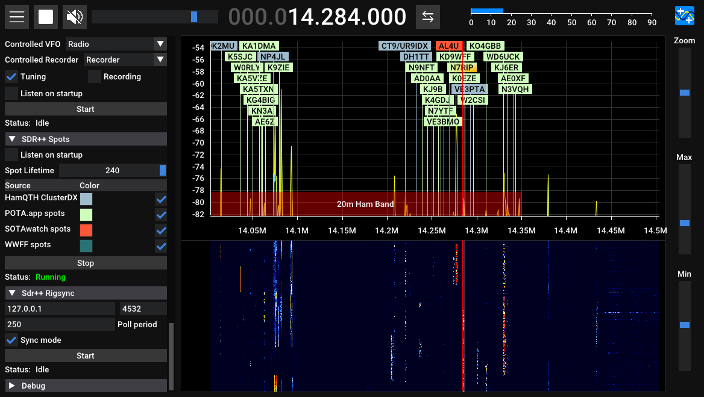

# SDR++ Spots Module

Adds spots to the waterfall display in [SDR++](https://github.com/AlexandreRouma/SDRPlusPlus).

Sources of spots:
 * ClusterDX network from [HamQTH](https://hamqth.com) API
 * [POTA.app](https://pota.app) spots
 * [SOTAWatch](https://sotawatch.sota.org.uk/en/) spots
 * [World Wide Flora and Fauna in amateur radio](https://wwff.co/) spots

# Building

This module is built in-tree by SDR++ when `OPT_BUILD_SPOTS` is enabled.
Enable the module from the module manager after installing SDR++.

Thanks to [dbdexter-dev/sdrpp_radiosonde](https://github.com/dbdexter-dev/sdrpp_radiosonde/tree/master) from which I based these directions.
